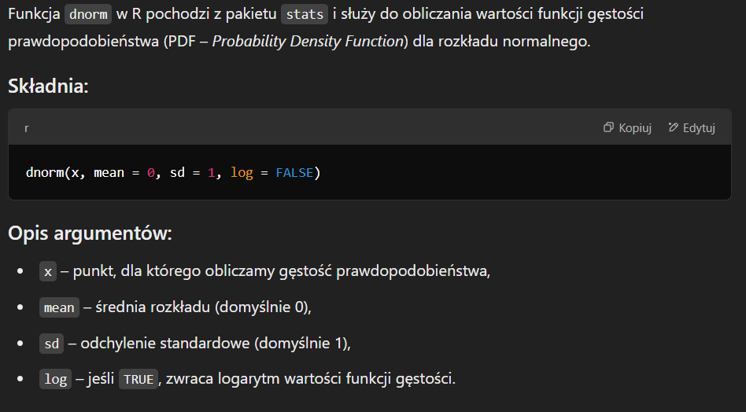
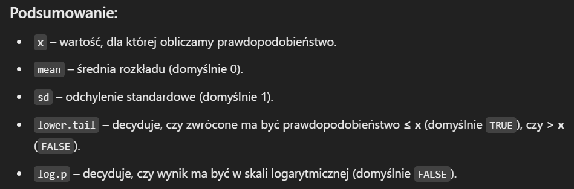
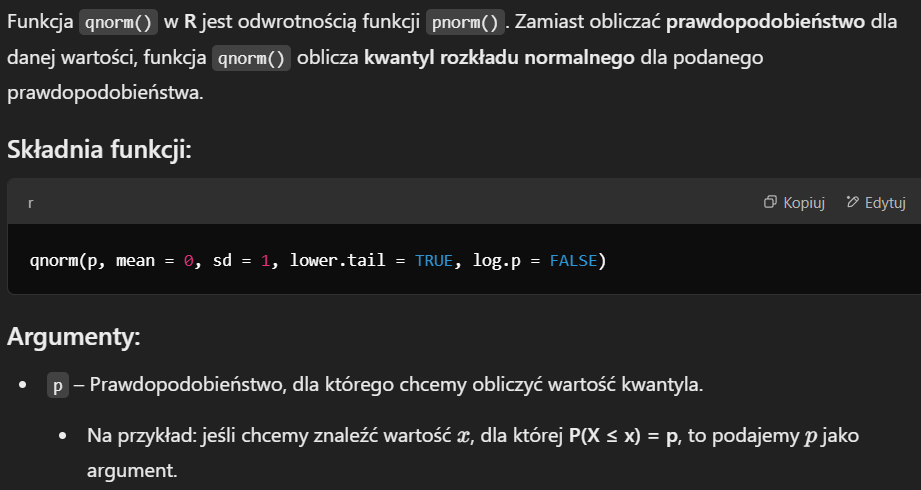
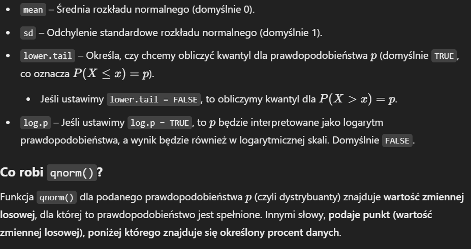
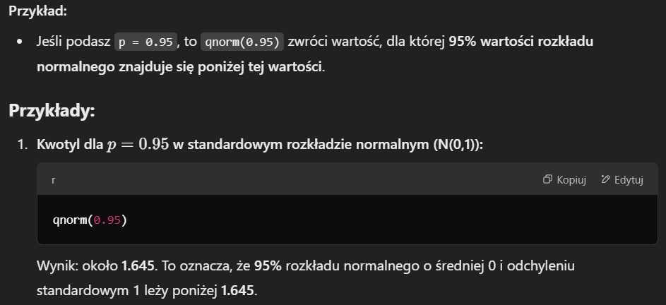
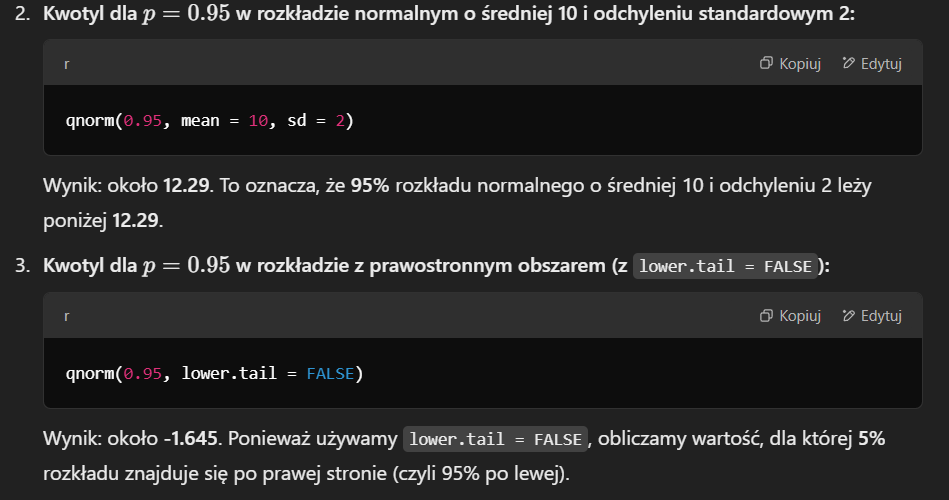

```{r}
library(tidyverse)
set.seed(123) 
```


1. Wylosować dziesięć liczb z rozkładów normalnych o średniej dowolnej i odchyleniu standardowym
dowolnym.

```{r}
x <- rnorm(10, mean = 0, sd = 1)
x
```

2. Sprawdzić co oznaczają funkcje:


```{r}
dnorm(x, mean=0, sd=1, log = FALSE)
```
```{r, echo=FALSE, out.width="50%"}

```

```{r}
pnorm(x, mean=0, sd=1, lower.tail = TRUE, log.p = FALSE)
```

```{r, echo=FALSE, out.width="50%"}


```

```{r}
p <- seq(-0.1, 1.1, by = 0.1)
qnorm(p, mean=0, sd=1, lower.tail = TRUE, log.p = FALSE)
```
```{r, echo=FALSE, out.width="50%"}





```


```{r}
rnorm(10, mean=0, sd=1)
```


```{r, echo=FALSE, out.width="50%"}

```


3. Wysymulować:

a)  100 zmiennych losowych o rozkładzie dwumianowym z n=10 ip=0,45.

```{r}
a <- rbinom(100, size = 10, prob = 0.45)
head(a, 10)
```

b) Symuluj 1000 zmiennych losowych o rozkładzie jednostajnym z a=7 i b=10.

```{r}
b <- runif(1000, min = 7, max = 10)
head(b, 10)
```

c) Symuluj 100 zmiennych losowych o rozkładzie Poissona z λ=3.

```{r}
c <- rpois(100, lambda = 3)
head(c, 10)
```

d) Symuluj 1000 zmiennych losowych o rozkładzie normalnym z μ=544 i σ=103.

```{r}
d <- rnorm(1000, mean = 544, sd = 103)
head(d, 10)
```

e) Symuluj 1000 zmiennych losowych o rozkładzie logarytmiczno-normalnym z μ=1,2 i σ=0,5.

```{r}
e <- rlnorm(1000, meanlog = 1.2, sdlog = 0.5)
head(e, 10)
```

f) Sporządź wykres CDF dla powyższych rozkładów.

```{r}
dfa <- data.frame(x = a, CDF = ecdf_a(sort(a)))
dfb <- data.frame(x = b, CDF = ecdf_a(sort(a)))
dfc <- data.frame(x = c, CDF = ecdf_a(sort(a)))
dfd <- data.frame(x = d, CDF = ecdf_a(sort(a)))
dfe <- data.frame(x = e, CDF = ecdf_a(sort(a)))


ggplot(dfa, aes(a)) + 
  stat_ecdf(geom = "step", pad = FALSE)

ggplot(dfb, aes(b)) + 
  stat_ecdf(geom = "step", pad = FALSE)

ggplot(dfc, aes(c)) + 
  stat_ecdf(geom = "step", pad = FALSE)

ggplot(dfd, aes(d)) + 
  stat_ecdf(geom = "step", pad = FALSE)

ggplot(dfe, aes(e)) + 
  stat_ecdf(geom = "step", pad = FALSE)
```

4. Narysować gęstość rozkładu normalnego (0,1), w przedziale [-4,4]
Na tym samym wykresie narysować dystrybuantę.


```{r}
x <- seq(-4, 4, by = 0.01)
y_density <- dnorm(x, mean = 0, sd = 1)  # Gęstość
y_cdf <- pnorm(x, mean = 0, sd = 1)     # Dystrybuanta

df <- data.frame(x = x, density = y_density, cdf = y_cdf)

ggplot(df) +
  geom_line(aes(x = x, y = density), color = "blue", size = 1) +
  geom_line(aes(x = x, y = cdf), color = "red", size = 1) +
  labs(title = "Gęstość i Dystrybuanta rozkładu normalnego (0,1)",
       x = "Wartość",
       y = "Wartość funkcji")
```


5. 
a) wylosować (z i bez powtórzeń) 10 wartości ze zbioru {1,2,…,20}
```{r}
a1 <- sample(1:20, 10, replace = TRUE)
a2 <- sample(1:20, 10, replace = FALSE)
a1
a2
```

b) Stworzyć dowolny wektor i wylosować z niego kilka liczb (z powtórzeniem, bez powtórzeń)

```{r}
b <- c(1:10)
b1 <- sample(c, 5, replace = TRUE)
b2 <- sample(c, 5, replace = FALSE)
b1
b2
```

c) Stworzyć macierz (5x2) z losowo wybranych (z dowolnego rozkładu jednostajnego) wartości,
nazwać kolumny macierzy A, B, z takiej macierzy wylosować (z i bez powtórzeń) 3 wiersze.

```{r}
c <- matrix(runif(10), nrow = 5, ncol = 2)
c
colnames(c) <- c("A", "B")
c1 <- c[sample(1:5, 3, replace = TRUE), ]
c2 <- c[sample(1:5, 3, replace = FALSE), ]
c1
c2
```

d) Wylosuj 20 razy wartości ze zbioru: {„O”, „R”}, ze zwracaniem.

```{r}
d <- sample(c("O", "R"), 20, replace = TRUE)
d
```

e) Wygeneruj 10 wartości pomiędzy 1 a 100; dodatkowo pokaż je posortowane.

```{r}
e <- runif(10, min = 1, max = 100)
sort(head(e, 20))
```

f) Wygenerować ciąg 0 i 1, tak żeby po pojawieniu się jedynki, kolejna jedynka miała 70% szans
na pojawienie się, a gdy pojawi się 0, to jedyna ma mieć 30% szans na pojawienie się.

```{r}
f <- numeric(50)
f[1] <- 1
for (i in 2:50) {
  if (f[i-1] == 1) {
    f[i] <- rbinom(1, 1, 0.7)
  } else {
    f[i] <- rbinom(1, 1, 0.3)
  }
}

f
```

6. 
a) sprawdź gęstość rozkładu normalnego w zerze,
```{r}
dnorm(0, mean = 0, sd = 1)
```

b) sprawdź dystrybuantę w zerze

```{r}
pnorm(0, mean = 0, sd = 1)
```

c) ile masy standardowego rozkładu normalnego N(0,1) mieści się między -3 a 3?
```{r}
pnorm(3, mean = 0, sd = 1) - pnorm(-3, mean = 0, sd = 1)
```

d) wygeneruj 100 obserwacji z rozkładu N(2,1)
```{r}
d <- rnorm(100, mean = 2, sd = 1)
head(d, 10)
```

e) znajdź pierwszy kwanty

```{r}
quantile(d, 0.25)
```

f) narysuj histogram 1000 liczb pseudolosowych ze standardowego rozkładu normalnego
```{r}
e <- rnorm(1000, mean = 0, sd = 1)
df <- data.frame(x = e)

ggplot(df, aes(x = e)) +
  geom_histogram(bins = 30, fill = "blue", color = "black") +
  labs(title = "Histogram rozkładu normalnego", x = "Wartości", y = "Częstotliwość") +
  theme_minimal()

```

g) wylosuj 1000 elementową próbę z rozkładu jednostajnego i narysuj jej histogram


```{r}
f <- runif(1000, min = 0, max = 1)
df <- data.frame(x = f)


ggplot(df, aes(x = f)) + 
  geom_histogram(bins = 30, fill = "blue", color = "black") +
  labs(title = "Histogram rozkładu jednostajnego", x = "Wartości", y = "Częstotliwość") +
  theme_minimal()
```

7. 
a) Wygeneruj 50 wartości z przedziału 1 do 99 zgodnie z rozkładem jednostajnym.
```{r}
a <- runif(50, min = 1, max = 99)
head(a, 10)
```


b) Wygeneruj 5 losowych wartości z rozkładu jednostajnego.
```{r}
b <- runif(5)
b
```

c) Wygeneruj 5 losowych wartości z rozkładu jednostajnego z przedziału [5, 99].
```{r}
c <- runif(5, min = 5, max = 99)
c
```

d) Wygeneruj 5 losowych, całkowitych wartości z rozkładu jednostajnego z przedziału [0,100].
```{r}
d <- sample(0:100, 5, replace = FALSE)
d
```

e) Wygeneruj 5 losowych, całkowitych wartości z rozkładu jednostajnego z przedziału 
[0,100], losowanie bez powtórzeń.
```{r}
e <- sample(0:100, 5, replace = TRUE)
e
```


8. Rozkład wykładniczy jest używany np. do opisu żywotności komponentów elektronicznych.
Niech średnia żywotność lampy elektrycznej będzie równa 1500 godzin. Wylosuj sto wartości
z rozkładu exp (z parametrem \lambda = 1/1500). Narysuj histogram oraz gęstość rozkładu
wylosowanych wartości.

```{r}
a <- rexp(100, rate = 1/1500)
df <- data.frame(x = a)

ggplot(df, aes(x = a)) +
  geom_histogram(bins = 30, fill = 'blue', color = 'black') +
  labs(title = "Histogram rozkładu wykładniczego", x = "Wartości", y = "Częstotliwość") +
  theme_minimal()

```

9. Dzienna ilość kawy w litrach dozowana przez maszynę znajdującą się w holu lotniska jest
zmienną losową X o ciągłym równomiernym rozkładzie przy a=7 i b=10.
(a) Znajdź wartość funkcji gęstości przy x=7,6.
```{r}
a <- 7
b <- 10
x <- 7.6

density <- dunif(x, min = a, max = b)
density
```


(b) Sporządź wykres prawdopodobieństwa jednostajnego rozkładu.

```{r}
ggplot(data.frame(x = c(a, b)), aes(x = x)) +
  geom_segment(aes(x = a, xend = b, y = density_value, yend = density_value), color = "blue") +
  geom_segment(aes(x = a, xend = a, y = 0, yend = density_value), color = "blue") +
  geom_segment(aes(x = b, xend = b, y = 0, yend = density_value), color = "blue") +
  labs(title = "Rozkład jednostajny", x = "x", y = "gęstość") +
  theme_minimal()
```

(c) Znajdź prawdopodobieństwo, że w danym dniu ilość kawy dozowana przez maszynę wyniesie
co najwyżej 8,8 litra.
```{r}
p <- punif(8.8, min = a, max = b)
p
```


(d) Znajdź prawdopodobieństwo, że w danym dniu ilość kawy dozowana przez automat wyniesie
co najmniej 8,5 litra.

```{r}
prob <- 1 - punif(8.5, min = a, max = b)
prob
```

(e) Znajdź prawdopodobieństwo, że w danym dniu ilość kawy dozowana przez urządzenie będzie
większa niż 7,4 litra, ale mniejsza niż 9,5 litra.

```{r}
p <- punif(9.5, min = a, max = b) - punif(7.4, min = a, max = b)
p
```

(f) Sporządź wykres CDF.
```{r}
a <- 7
b <- 10

data <- runif(1000, min = a, max = b)

ggplot(data.frame(x = data), aes(x = x)) +
  stat_ecdf(geom = "step", color = "blue", size = 1.2) +
  labs(title = "CDF", x = "x", y = "P(X ≤ x)") +
  theme_minimal()
```

(g) Jaka jest wartość c, jeśli P(X≤c)≥0,60?

```{r}
c <- qunif(0.6, min = a, max = b)
c
```

(h) Symuluj 1000 zmiennych losowych o rozkładzie jednostajnym z a=7 i b=10

```{r}
data <- runif(1000, min = a, max = b)
head(data, 10)
```

10. Stary autobus psuje się średnio 3 razy w miesiącu. (W zadaniu użyj rozkładu
prawdopodobieństwa Poissona.
(a) Znajdź prawdopodobieństwo, że nastąpią dokładnie 2 awarie w następnym miesiącu.
```{r}
p <- dpois(2, lambda = 3)
p
```

(b) Sporządź wykres rozkładu prawdopodobieństwa Poissona.
```{r}

x <- 0:10
y <- dpois(x, 3)
df <- data.frame(x = x, Probability = y)

# Tworzenie wykresu
ggplot(df, aes(x = x, y = Probability)) +
  geom_bar(stat = "identity", fill = "blue", color = "black") +
  labs(title = "Rozkład Poissona", x = "Liczba zdarzeń", y = "P(X = x)") +
  theme_minimal()

```

(c) Jakie jest prawdopodobieństwo, że co najwyżej jedna awaria wystapi w następnym
miesiącu?
```{r}
p <- dpois(0, 3) + dpois(1, 3)
p
```

(d) Jakie jest prawdopodobieństwo co najmniej 3 awarii w następnym miesiącu?
```{r}
p <- 1 - (dpois(0, 3) + dpois(1, 3) + dpois(2, 3))
p
```

(e) Jakie jest prawdopodobieństwo wystąpienia od 2 do 4 (włącznie) awarii w ciągu następnego
miesiąca?
```{r}
p <- dpois(2, 3) + dpois(3, 3) + dpois(4, 3)
p
```

(f) Sporządź wykres CDF rozkładu Poissona.
```{r}
cdf_vals <- ppois(x, 3)
df <- data.frame(x = x, CDF = cdf_vals)

ggplot(df, aes(x = x, y = CDF)) +
  geom_step(color = "blue", size = 1) +
  labs(title = "Dystrybuanta rozkładu Poissona", x = "Liczba awarii", y = "P(X ≤ x)") +
  theme_minimal()
```

(g) Jaka jest wartość c, jeśli P(X≤c)≥0,60?
```{r}
c <- qpois(0.6, 3)
c
```

(h) Symuluj 100 zmiennych losowych o rozkładzie Poissona z λ=3.
```{r}
data <- rpois(100, lambda = 3)
head(data, 20)
```

